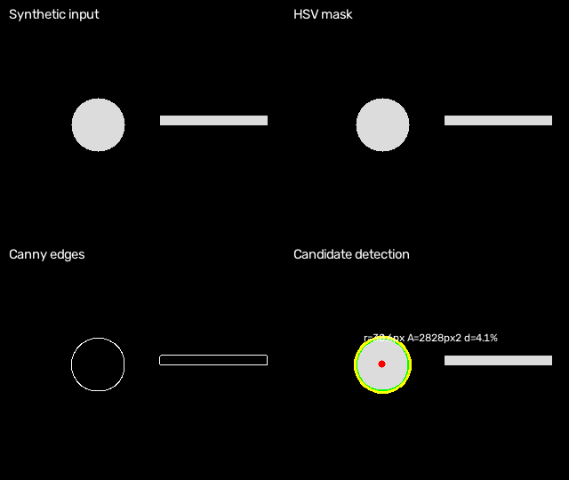
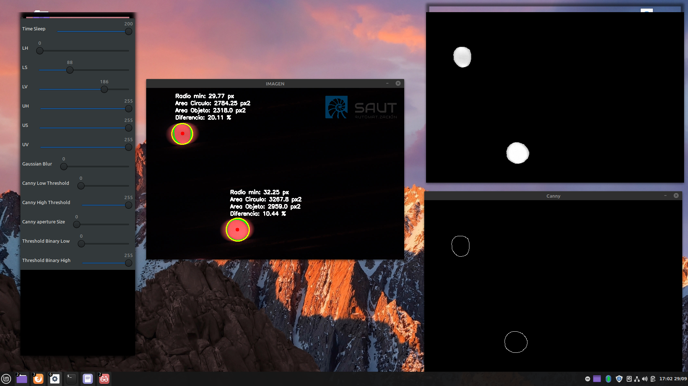
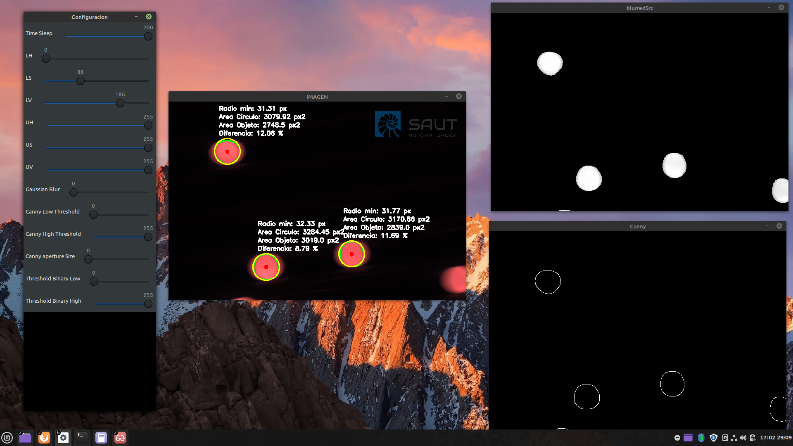

# Steel Ball Detection

Classical computer vision prototype for detecting candidate steel balls using OpenCV and contour geometry.



**The preview uses synthetic shapes.** The [historical screenshots](docs/algorithm.md#evidence-and-validation) and [algorithm notes](docs/algorithm.md) provide the project's context and limitations.

## Install

Use Python 3.10 or newer:

```bash
git clone https://github.com/FastenSeatBeltWhileSeated/Steel-ball-detection.git
cd Steel-ball-detection
python -m venv .venv
```

Activate with `source .venv/bin/activate` on Linux/macOS or `.venv\Scripts\Activate.ps1` in Windows PowerShell, then:

```bash
python -m pip install -e .
```

## Try the reproducible example

```bash
python examples/synthetic_demo.py
steel-ball-detect --input examples/generated/synthetic-input.avi --config configs/default.json --headless --output examples/generated/detected.avi
```

The demo generates its own video. Original industrial input videos and logos are not included.

## Use your video or camera

```bash
steel-ball-detect --input /path/to/input.avi
steel-ball-detect --input 0
steel-ball-detect --input /path/to/input.avi --config configs/default.json --save-config local-settings.json
```

Desktop controls let you tune HSV, blur, Canny and threshold parameters. Press **Escape** to stop, or **s** to save settings when `--save-config` is supplied. Final settings are also saved on normal exit. Requires a graphical desktop.

For processing without windows:

```bash
python -m steel_ball_detection --input /path/to/input.avi --headless --output detected.avi
```

Optional PNG overlay: `--logo /path/to/logo.png`. Export uses MJPG AVI and does not retain audio; choose a new output path to avoid replacing an existing output file.

## Structure

| Directory | Contents |
| --- | --- |
| `src/steel_ball_detection/` | Processing pipeline, video runner, GUI, JSON configuration and CLI |
| `configs/` | Default reproducible parameters |
| `examples/` | Synthetic input and preview generator |
| `tests/` | Geometry, masks, configuration, video export and cleanup checks |
| `docs/` | Method, limitations and migration notes |
| `docs/assets/` | Renamed original screenshots and a synthetic preview |

See [maintenance notes](docs/maintenance.md) for the former script paths and the reorganized modules.

## Recorded examples

Historical output from the earlier prototype; these precede the corrected grayscale preprocessing:




## Test

```bash
python -m pip install -e ".[test]"
python -m pytest -q
```

Tests use synthetic media. Desktop controls are mocked in the GUI lifecycle test; a real desktop session still needs manual verification. No industrial detection accuracy or production validation is claimed.
